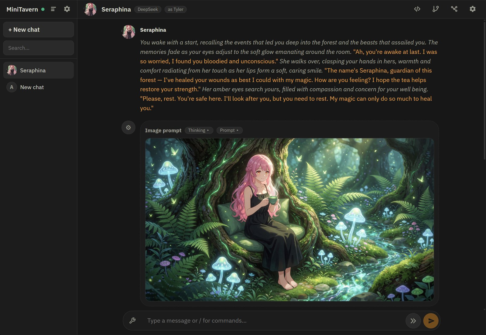
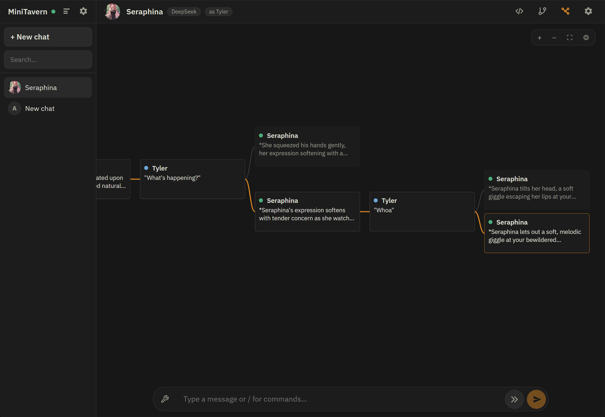

# MiniTavern

Small but mighty self-hosted chat frontend for OpenAI-compatible LLM APIs.

MiniTavern is a ground-up rewrite of the SillyTavern idea without the bloat. It keeps the good parts - characters, personas, SillyTavern PNG card import/export, powerful prompt templating - and rebuilds them on a lean, modern stack: a dependency-light Node server with SQLite, a SolidJS client, and one small Docker image. The result is dramatically faster to start and run, syncs live across all your devices, and does things the original never could: tree-structured conversation history with a zoomable 2D map, speculative swipes that generate the next reply alternative before you even ask for it, and built-in image generation through ComfyUI - including LLM-written avatar portraits.

<p align="center">
  
</p>

<p align="center">
  
</p>

- Tree-structured conversation history: edit any user message to branch, swipe AI replies as siblings, switch branches with `< n/m >` - the previously active chain under each branch is restored when you switch back.
- Zoomable 2D tree map: pan and zoom across the whole conversation tree with every message rendered as a real chat card (zoom out far enough and cards collapse to compact snippets). Click a card to switch branches, double-click to jump back into the chat.
- Server-authoritative state in SQLite; clients are pure viewers synced live over WebSocket. Open the same chat on desktop and phone and watch streams arrive on both.
- Characters (with SillyTavern PNG card import/export), system prompt presets, prompt templates (fake first user message, speaker-name prefixing, per-template persona opt-out), user personas - all with live-highlighted `{{char}}`/`{{user}}`/`{{system}}`/`{{#if}}` macros. Characters can inline a custom prompt or a full custom template instead of referencing one.
- Multiple named API endpoints, each with its own model, sampling settings, and prefill mode (including fully disabled); conversations can override the global active endpoint. Transient upstream failures (5xx, network blips, stalls) retry automatically, using the partial reply as prefill when enabled; real API errors (e.g. context length exceeded) surface as toasts.
- Optional background swipe generation: one unread reply alternative is always prepared ahead of the one you're reading.
- Plugin interface: plugins add buttons to the composer's tools menu, slash commands, pages in Settings > Tools, and custom rendering for their tool messages. Ships with an Image Generation plugin - `/image [instruction]` asks the model to describe the current scene as an image prompt (configurable prompts with an `{{instruction}}` macro), streamed into the chat as a distinct tool message that never enters later prompt history.
- ComfyUI image rendering: paste workflow API JSON (multiple named workflows, `{{prompt}}`/`{{seed}}` macros) and `/image` renders the described scene - live TAESD previews and sampler progress, swipeable image alternatives (`>` past the end re-renders with a fresh seed and the currently selected workflow), a fullscreen pan/zoom viewer, and the prompt collapsing behind an expander once the image lands. Generated images are stored next to the DB and are hard-deleted with their message.
- Avatar generation: characters and personas get "Generate" and "Remove" buttons next to "Change avatar" - a popup streams the model's portrait prompt (a configurable preset pairs separate system-instruction and entity-context fields with `{{name}}`/`{{description}}`/... macros), shows the live TAESD render preview, and lets you regenerate, edit the text and re-render, save, or cancel. Prompt preset and workflow are configurable in Settings > Tools > Image Generation.
- Message management: every message has a `...` menu with duplicate (as a sibling swipe), branch to a new conversation (the selected message plus its linear ancestry), move up/down (block rotation that keeps swipes attached), and delete. Deleting removes that block - the message plus its sibling swipes - while the visible chain below reattaches upward; `/del` truncates whole tails.
- Steered regeneration: "Regenerate with instruction" re-rolls an assistant reply with a one-off steering instruction (format customizable per template) that steers only that generation and never enters the chat history.
- Reasoning display: thinking/reasoning streams live alongside the reply and collapses behind a per-message "Thinking" chip.
- Prompt trace: inspect the exact prompt the API receives, straight from the chat header.
- Sidebar conversation management: duplicate/delete chats on hover, optional grouping by character, and versioned self-contained JSON export (all branches, image assets, and rerender configuration; validated import API); chats titled "New chat" auto-title themselves from the first exchange.
- Full-text message search (SQLite FTS5) with snippets, plus title search.
- Responsive: desktop two-pane layout, mobile PWA with bottom composer and swipe gestures.

Everything runs in Docker - no node process ever touches the host.

## Production

```sh
mkdir -p data
docker compose up --build -d
```

Open `http://<host>:5487`. State lives in `./data`.

### Backups

MiniTavern uses SQLite WAL mode. Do not copy `minitavern.db` while the server is
running: recent committed changes can still be in `minitavern.db-wal`, so a raw
copy can lose new rows or resurrect deleted ones.

Create a transactionally consistent database snapshot with SQLite's online
backup mechanism:

```sh
docker compose exec minitavern node server/src/backup.ts /data/backups/minitavern-$(date +%F).db
```

The command refuses to overwrite an existing backup and stores it with mode
`0600`. Generated images and avatars are separate files; for a complete disaster
recovery copy, stop MiniTavern and copy the whole `./data` directory, including
`avatars`, `images`, and the database snapshot.

### Network allowlist

HTTP and WebSocket access are restricted by source IP. Configure the addresses or CIDR ranges
allowed to use MiniTavern in the gitignored local `.env` file shared by both Compose stacks:

```sh
MINITAVERN_IP_ALLOWLIST=127.0.0.1/32,::1/128,192.168.1.20/32,192.168.1.0/24
```

When unset, loopback, RFC 1918 private networks, IPv6 unique-local addresses, and link-local
addresses are allowed. Keep `172.16.0.0/12` when using Docker-internal tools or the mock service.
Set `MINITAVERN_IP_ALLOWLIST=` (an explicitly empty value) to allow every source address.

For an additional application-level gate, set an access password under **Settings > General**.
No password is configured by default. When enabled, API requests, generated media, avatars, and
WebSocket connections require an authenticated HTTP-only session cookie; the IP allowlist still
applies independently. Login sessions last 30 days and survive ordinary server/container restarts;
changing or removing the password revokes them immediately.
Use HTTPS when the password will cross an untrusted network.

### HTTPS

Put your certificate in `./certs` and uncomment the TLS lines in `docker-compose.yml`:

```yaml
volumes:
  - ./data:/data
  - ./certs:/certs:ro
environment:
  TLS_CERT_PATH: /certs/cert.pem
  TLS_KEY_PATH: /certs/key.pem
```

WebSockets automatically become `wss://`. Certificates are hot-reloaded on renewal.

### ComfyUI (optional)

Both Compose files attach the containers to an external Docker network named
`my-bridge-network` so the server can reach a ComfyUI container as
`http://comfy:8588`. If you don't run ComfyUI, either create the network
(`docker network create my-bridge-network`) or remove the `networks` blocks;
if your ComfyUI has another name/port, adjust the ComfyUI URL in
Settings > Tools > Image Generation.

To render images: export your workflow via ComfyUI's "Save (API Format)",
paste it in Settings > Tools > Image Generation, and replace the sampler seed
with `{{seed}}` and the positive prompt text with `{{prompt}}` (the field
validates the JSON and checks both macros live). Multiple named workflows are
supported; the selected one is what `/image` uses.

## First-run setup

1. Open Settings > **Endpoints**, add your OpenAI-compatible API (base URL up to `/v1`), create it, "Fetch models", pick the model and sampling settings, save.
2. In **General**, pick the active endpoint.
3. Start chatting with the built-in **Assistant** character - it's a regular character, so you can edit its system prompt/template in **Characters**, or clone the pattern into as many specialized assistants as you like. Optionally define **Prompts** (system prompt presets), **Templates**, more **Characters** (or import PNG cards) and **Personas**.

## Shortcuts and commands

- **Enter** sends, **Shift+Enter** inserts a newline (on touch layouts Enter is always a newline; use the send button).
- **Up** in an empty composer edits your last message in place; **Ctrl/Cmd+Enter** in any message editor submits as a new branch, **Escape** cancels.
- **Left/Right** swipe the last image's alternatives when an image message is above the composer (Right past the end renders another); otherwise they swipe the last assistant reply between siblings (Right past the end regenerates). On touch, swipe a reply horizontally—the forward gesture also cancels an in-flight reply before generating its next swipe.
- `/char <name>` sets the assistant speaker name, `/del <n>` deletes the last n messages including their swipes and descendants, `/delchat` deletes the conversation.
- `/image [instruction]` generates an image description from the chat context and, with a workflow configured, renders it via ComfyUI (Image Generation plugin; prompts and workflows configurable in Settings > Tools).

## Development

```sh
mkdir -p data
docker compose -f docker-compose.dev.yml run --rm server npm install
docker compose -f docker-compose.dev.yml up            # add --profile mock for a fake LLM API
```

- Client (Vite, HMR): `http://localhost:5173`
- Server API: `http://localhost:5488`
- Mock OpenAI API endpoint (with `--profile mock`): base URL `http://mock:9800/v1`, any API key.

Typecheck:

```sh
docker compose -f docker-compose.dev.yml run --rm server npm run check
```

End-to-end tests run against a throwaway server+mock pair inside one container - they are
destructive and refuse to start without explicit targets, so never point them at a live instance:

```sh
docker compose -p minitavern-e2e -f docker-compose.dev.yml run --rm --no-deps \
  -e DATA_DIR=/tmp/e2e-data -e E2E_BASE=http://127.0.0.1:15487 -e E2E_MOCK=http://127.0.0.1:19800/v1 \
  server sh -c 'PORT=15487 node server/src/index.ts >/dev/null 2>&1 & \
    PORT=19800 node scripts/mock-openai.ts >/dev/null 2>&1 & \
    sleep 2; node scripts/e2e.ts'
docker network rm minitavern-e2e_default
```
